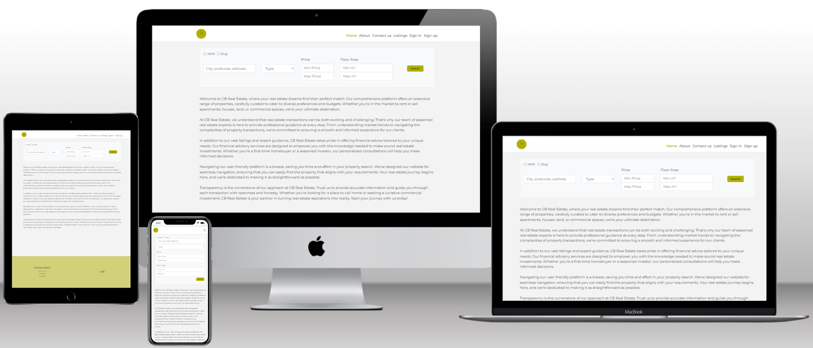

# CB Real Estate



CB Real Estate represents the culmination of my efforts during the final project for Code Institute, serving as a dynamic platform designed for further development and potential client adoption. Focused on real estate, the site empowers users to effortlessly search for their next home, office space, or the ideal plot of land for construction. The inclusion of user accounts allows individuals to curate a personalized wishlist, tracking properties of interest, and facilitating seamless communication through a user-friendly contact form. Currently, property uploads are restricted to administrators, ensuring quality control, but the future vision includes the possibility for registered agents to contribute their listings. As the project evolves, CB Real Estate aims to provide an enriched and intuitive platform for users to explore and engage with the real estate market.

Deployed API Heroku: [API link](https://re-drf-api-f69fb4705742.herokuapp.com/)

Deployed Frontend Heroku: [CB Real Estate](https://re-real-estate-ecc213881132.herokuapp.com/)

Backend Github [Repository](https://github.com/Vasileios20/drf-real-estate)

Frontend Github [Repository](https://github.com/Vasileios20/real-estate)


## Contents

* [Design](#design)
  * [Colour Scheme](#colour-scheme)
  * [Typography](#typography)
  * [Wireframes](#wireframes)
* [User Experience (UX)](#user-experience-ux)
  * [Site Purpose](#site-purpose)
  * [Site Goal](#site-goal)
  * [Audience](#audience)
  * [Communication](#communication)
  * [Current User Goals](#current-user-goals)
  * [New User Goals](#new-user-goals)
  * [Future Goals](#future-goals)
* [User Stories](#user-stories)
* [Features](#features)
  * [Navigation Bar](#navigation-bar)
    * [Navigation Bar (logged in)](#navigation-bar-logged-in)
    * [Navigation Bar (Admin)](#navigation-bar-admin-user)
  * [Footer](#footer)
  * [Home Page](#home-page)
  * [About Page](#about-page)
  * [Contact us Page](#contact-page)
  * [Listings Page](#listings-page)
  * [Listing Page](#listing-page)
    * [Images modal](#images-modal)
  * [Add Listing Page](#add-listing-page)
  * [Edit Listing Page](#edit-listing-page)
  * [Messages Page](#messages-page)
    * [Message Page](#message-page)
  * [Sign in Page](#sign-in-page)
  * [Signup Page](#sign-up-page)
  * [Wishlist Page](#wishlist-page)
  * [Profile Page](#profile-page)
    * [Edit Profile](#edit-profile-page)
    * [Change username](#change-username-page)
    * [Change password](#change-password-page)
  * [403 error Page](#403-error-page)
  * [404 error Page](#404-error-page)
* [Reusable Components](#reusable-components)
* [Technologies Used](#technologies-used)
  * [Languages Used](#languages-used)
  * [Frameworks, Libraries & Programs Used](#frameworks-libraries--programs-used)
* [Deployment and Local Development](#deployment-and-local-development)
  * [Local Development](#local-development)
    * [How to fork](#how-to-fork)
    * [How to clone](#how-to-clone)
    * [Deployment](#deployment)
* [Testing](#testing)
* [Credits](#credits)

## Design

### Colour Scheme


The main 2 colours (#b0b000 and #606000) have been chosen to match the logo.

### Typography

The font [Montserrat](https://fonts.google.com/specimen/Montserrat)
has been chose be chosen, because of its clean and modern appearance,
its readability and it's a web friendly font.

### Wireframes

#### Desktop

[Home Page](/documentation/wireframes/Home_Page.png)

[About Page](/documentation/wireframes/About_Page.png)

[Contact page](/documentation/wireframes/Contact_Form.png)

[Add Listing](/documentation/wireframes/Listing_Add.png)

[Edit Listing](/documentation/wireframes/Listing_Edit.png)

[Listing Page Content](/documentation/wireframes/Listing_Page_Content.png)

[Listing Page Images](/documentation/wireframes/Listing_Page_Images.png/)

[Listings](/documentation/wireframes/Listing_results_Page.png/)

[Wishlist](/documentation/wireframes/Wishlist_Page.png)

[Messages Page](/documentation/wireframes/Messages.png)

[Message Page](/documentation/wireframes/Message.png)

[Sign in](/documentation/wireframes/Sign_in.png)

[Signup](/documentation/wireframes/Sign_Up.png)

#### Mobile

[Home Page](/documentation/wireframes/Mobile_Home.png)

[About Page](/documentation/wireframes/Mobile%20_About.png)

[Contact page](/documentation/wireframes/Mobile_Contact.png)

[Add Listing](/documentation/wireframes/Mobile_Listing_Add.png)

[Edit Listing](/documentation/wireframes/Mobile_Listing_Edit.png)

[Listing Page Content](/documentation/wireframes/Mobile_Listing_Page.png)

[Listings](/documentation/wireframes/Mobile_Listings.png)

[Wishlist](/documentation/wireframes/Mobile_Wishlist.png)

[Messages Page](/documentation/wireframes/Mobile_Messages.png)

[Sign in](/documentation/wireframes/Mobile_Sign_in.png)

[Sign up](/documentation/wireframes/Mobile_Sign_up.png)

## User Experience (UX)

### Site Purpose

The primary purpose of CB Real Estate is to provide a comprehensive and user-friendly online platform for individuals seeking real estate opportunities. Whether users are looking for a new residence, office space, or land for development, the site aims to facilitate a seamless and efficient search experience.

### Site Goal

CB Real Estate strives to become a go-to destination for real estate exploration, connecting users with their ideal properties. The overarching goal is to establish a reliable and engaging platform that not only meets current user needs but also anticipates and adapts to evolving real estate trends.

### Audience

The target audience for CB Real Estate includes individuals in search of residential properties, commercial spaces, and land for development. Additionally, the site caters to registered users interested in building personalized wishlists, fostering engagement and loyalty.

### Communication

The site communicates property listings, features, and functionalities clearly and concisely to users. Through an intuitive interface, CB Real Estate aims to convey information effectively, ensuring a positive and informative user experience. Regular updates and notifications contribute to ongoing communication with users.

### Current User Goals

Existing users on CB Real Estate aspire to efficiently search and find properties that align with their needs. They also seek to manage and curate personalized wishlists, making the platform a valuable tool in their real estate journey. Clear communication channels, such as the contact form, facilitate inquiries and engagement.

### New User Goals

New users are expected to explore the site with ease, understanding its features and functionalities. Their primary goals include discovering available properties, understanding the wishlist feature, and initiating communication through the contact form. A seamless onboarding process is crucial to ensure positive initial interactions.

### Future Goals

CB Real Estate's future goals include expanding its user base by potentially allowing agents to register and contribute property listings. The site aims to enhance its functionality to accommodate a broader range of real estate needs and evolving market demands. Continued improvements in user experience and feature development are key aspects of the platform's ongoing evolution.

## User Stories

I have included links to the [GitHub Issues](https://github.com/Vasileios20/real-estate/issues) for this project, as well as the [KANBAN board](https://github.com/users/Vasileios20/projects/6).

## Features

* [Favicon](/documentation/features/favicon.png)

All pages on the site are responsive and have :

* ### Navigation Bar

Site user [navbar](/documentation/features/Navbar.png) contains the logo (acts as home button), Home, About, Contact us,
Listings, Sign in and Sign up

* #### Navigation Bar (logged in)

Logged in user [navbar](/documentation/features/Navbar(logged_in).png) contains the logo (acts as home button), Home, About, Contact us,
Listings, Wishlist and Sign out .

* #### Navigation Bar (Admin user)

Admin user [navbar](/documentation/features/Navbar(Admin).png) contains the logged in icons plus the Add listing and Messages.

* ### Footer

The [Footer](/documentation/features/Footer.png) displays links for the About us, Contact and Listings. It also displays Github and Linkedin icons.

___

### Home Page

The [Home Page](/documentation/features/Home_Page.png) displays the search bar and information about the website.

### About Page

The [About Page](/documentation/features/About_Page.png) displays the search bar and about CB Real Estate's mission and values.

### Contact Page

The [Contact Page](/documentation/features/Contact_us_Page.png) displays a contact form.

### Listings Page

The [Listings Page](/documentation/features/Listings_Page.png) displays the search bar and the listings in a container with infinite scroll.

### Listing Page

  The Listing Page displays the listing's images [on top of the page](/documentation/features/Listing_Page(1).png) in a carusel, when hovered over image a tooltip with a message to click on image for larger view, the [listing's features bellow](/documentation/features/Listing_Page(2).png) and a button to add to or remove from wishlist.
  If user is not logged in will and try to add to list will be redirected to sign in page.
  
#### Images Modal

  When click on an image, the [modal](/documentation/features/Images_modal.png) will pop up and display the images in a carusel.

### Add Listing Page

  The Add Listing Page ([1](/documentation/features/Add_listing(1).png), [2](/documentation/features/Add_listing(2).png),
  [3](/documentation/features/Add_listing(3).png)) contains a form with fields to upload images, type, sale_type, description,
  address_number,address_street, postcode, city, price, surface, levels, bedrooms, floor, kitchens, bathrooms,
  living_rooms, heating_system, energy_class, construction_year, availability.

### Edit Listing Page

  The [Edit Listing Page](/documentation/features/Listing_Edit.png) contains the existed images with a checkbox next to each, a button to delete images, a button to add images and all fields from the Add Listing Page filled with the existed values.

### Messages Page

  The [Messages Page](/documentation/features/Messages_Page.png) displays a search bar that has fields for query (name, email, subject) and
  a list of the message in a container with infinite scroll.
  
#### Message page

  The [Message Page](/documentation/features/Message_Page.png) displays the message in a card with the fields of name, email, subject and
    message.

### Sign in Page

The [Sign in Page](/documentation/features/Sign_in.png) displays the Sign in form, an image on the right and a link to sign up page.

### Sign up Page

The [Signup Page](/documentation/features/Sign_up.png) displays the sign up form, an image on the rigt and a link to sign in page.

### Wishlist Page

Only registered users can visit the wishlist page.

The [Wishlist Page](/documentation/features/Wishlist_Page.png) displays the search bar and a list of the user's list of properties added
or a message "Your list is empty".

### Profile Page

The [Profile Page](/documentation/features/Profile_Page.png) displays the user's details and a carret down icon to open the [dropdown menu](/documentation/features/Profile_dropdown.png)
that display icons to [edit profile](/documentation/features/Profile_Edit.png), [change username](/documentation/features/Change_username.png) and [changee password](/documentation/features/Change_password.png)

#### Edit Profile Page

The [Edit Profile](/documentation/features/Profile_Edit.png) displays a form to update the image, the first name, the last name, the email address and the phone number.

#### Change Username Page

The [Change username Page](/documentation/features/Change_username.png) displays a form to udpate the username.

#### Change Password Page

The [Change password Page](/documentation/features/Change_password.png) displays a form with 2 fields (new password and confirm password).

### 403 error page

The [403 page](/documentation/features/403.png) displays an image with a text error 403: Forbidden.

### 404 error page

The [404 page](/documentation/features/404.png) displays an image with a text error 404: Not found.

## Reusable Components

[SearchBar.js](/documentation/features/Searchbar.png) that exists in the home page, the about page, the listings page and
if logged in user, in the wishlist page.

Dropdown menu: exists in the [Listing.js](/documentation/features/DropdownMenu.png) (only for admins) and in the [ProfilePage.js](/documentation/features/DropdownMenuProfile.png)

ListingFormTextFields.js: displays the input fields for the ListingCreateForm and ListingEditForm.

ListingHeader.js: displays basic info for a property(listing) and it exists in the Listing, ListingsWishlistPage.

ListingsWishlistPage.js : to display all the listings, results of listings after a search and the user's wishlist

axiosDefault.js : for ease of communication with the backend API.

Asset.js : to supply the loading spinner & user avatar throughout the site.

CurrentUserContext.js : confirm users logged-in status to determine what functionality is available to that user.

useRedirect.js : redirects a user to another page if they are not authorised to be on the page they are trying to access.

utils.js : supplies functionality to all of the components that utilise the Infinite Scroll.

ScrolltoTop.js: scrolls the page to top when user change page.

useFetchListings.js: to fetch listings from the API

useFetchWishlist.js: to fetch user's wishlist from the API

useUserStatus.js: to get user status to determine what functionality is available to that user.

## Technologies Used

### Languages Used

HTML, CSS, JS

### Frameworks, Libraries & Programs Used

* [React](https://legacy.reactjs.org/docs/getting-started.html) Javascript library for building the component based UI and avoiding having to refresh to display dynamic content
* [ESLint](https://eslint.org/) Linter for error checking and syntax analysis
* [React Bootstrap](https://react-bootstrap-v4.netlify.app/) CSS framework for styled components
* [Axios](https://axios-http.com/) Promise based http client for making http requests to the backend API
* [React Infinite Scroll](https://www.npmjs.com/package/react-infinite-scroll-component) Used to easily load extra content rather than paginating pages, for a better UX
* [React Router](https://v5.reactrouter.com/web/guides/quick-start) Used to dynamically load pages and aid site navigation for the user.
* [jwt-decode](https://www.npmjs.com/package/jwt-decode) A browser library that helps decoding JWT's token
* [Cloudinary](https://cloudinary.com/) - To host images

#### Programs Used

* [GitHub](https://github.com/) - To save and store files for the website.
* [VSCode](https://code.visualstudio.com/) - Code editor used for local development.
* [GitPod](https://gitpod.io/) - IDE used to create the site.
* [Balsamiq](https://balsamiq.com/) - Used to create wireframes.
* [Techsini](https://techsini.com/multi-mockup/index.php) - To display the web image in various devices.
* [Google Developer Tools](https://developer.chrome.com/docs/) - To test features, resposiveness and stylilng.
* [TinyPNG](https://tinypng.com/) - To reduce size of the images.
* [Favicon](https://favicon.io/) - To create favicon.
* [Shields IO](https://shields.io/) - To add badges to README.
* [Obsidian](https://code.visualstudio.com/) - To keep notes.
* [Coolors](https://coolors.co/) - To create palette image to README.
* [Canva](https://www.canva.com/) - To create the logo

## Deployment and Local Development

### Local Development

When in development:
run first ```nvn use 16.20.2``` to use this version of Node
run ```npm start``` to start the app

#### How to fork

To fork the repository :

1. Log in (sign up) to GitHub.
2. Go to the repository for this project [real-estate](https://github.com/Vasileios20/real-estate)
3. Click the fork button in the top right corner.

#### How to clone

To clone the repository :

1. Log in (sign up) to GitHub.
2. Go to the repository for this project [real-estate](https://github.com/Vasileios20/real-estate)
3. Click on the code button, select one of the HTTPS, SSH or GitHub CLI and copy the link shown.
4. Open the terminal in your code editor and change the current working directory to the location you want to use for the cloned directory.
5. Type 'git clone' into the terminal and then paste the link you copied in step 3. Press enter.

### Deployment

The site has been deployed using Heroku. Deployed site [CB Real Estate](https://re-real-estate-ecc213881132.herokuapp.com/). Follow these steps:

#### Connect to the API

Navigate to the Heroku app of the project DRF-API, and under the Settings tab, add the following configvars:

|KEY|VALUE|
|--|--|
|CLIENT_ORIGIN | <https://your-react-app-name.herokuapp.com>*|
|CLIENT_ORIGIN_DEV | <https://gitpod-browser-link.ws-eu54.gitpod.io>*|

*Check that the trailing slash \ at the end of both links has been removed.

#### Add the Herolu deployment commands

In package.json file, in the “scripts” section, add the following prebuild command:

```"heroku-prebuild": "npm install -g serve",```

This will install a package needed to serve our single page application on heroku

Add a Procfile at the root of the project with the following web command:

```web: serve -s build```

#### Heroku App

If you don't already have an account to Heroku, create one [here](https://www.heroku.com/).

* Create Heroku app
  * Go to the Heroku dashboard and click the "Create new app" button.
  * Name the app. Each app name on Heroku has to be unique.
  * Then select your region.
  * And then click "Create app".

* In heroku app
  * Go to the deploy tab.
  * Choose the deployment method.
  * Select Github, and confirm to connect to Github.
  * Search for the Github repository name.
  * Then click "connect".
  * Scroll down and click "Deploy Branch".

## Testing

Please see [Testing](TESTING.md)

## Credits

### Code Used

[Code Institute's](https://codeinstitute.net/) - Walkthrough project Moments

[React docs](https://legacy.reactjs.org/docs/getting-started.html)

[ScrollToTop](https://www.geeksforgeeks.org/how-to-create-a-scroll-to-top-button-in-react-js/)$^1$

[ScrollToTop](https://dev.to/kunalukey/scroll-to-top-when-route-changes-reactjs-react-router-3bgn)$^2$

[Stackoverflow](https://stackoverflow.com/) - For varius enquries I had

[delete images](https://stackoverflow.com/a/61987030/21953029) - This answer helped me to find another solution to delete images as my initial implementation wouldn't work as expected.

[stackoverflow](https://stackoverflow.com/questions/53949393/cant-perform-a-react-state-update-on-an-unmounted-component) - To fix warning for unmounted component.

### Media

403 and 404 error pages images [drlinkcheck](https://www.drlinkcheck.com/blog/free-http-error-images)

[upload image](https://codeinstitute.s3.amazonaws.com/AdvancedReact/upload.png) - To use it to the ListinCreateForm and ListinEditForm

[signIn image](https://www.freepik.com/free-photo/hand-presenting-model-house-home-loan-campaign_15667726.htm#fromView=search&page=1&position=1&uuid=5b4895ad-3e02-4d5e-82b7-75a26ce1959) - Image by rawpixel.com on Freepik

[signUp image](https://www.freepik.com/free-photo/woman-showing-with-one-hand-mini-house-real-state-concept-ai-generative_41954006.htm#fromView=search&page=1&position=51&uuid=e3c74710-bc46-413c-992b-e1187508f5fc) - Image by chandlervid85 on Freepik

[listing image 1](https://www.freepik.com/free-photo/modern-kitchen-interior-bright-colors_31023435.htm#fromView=search&page=1&position=15&uuid=28c86659-c683-4859-bb88-ebc92f29cc57) - Image by wirestock on Freepik

[listing image 2](https://www.freepik.com/free-photo/modern-empty-room_94962432.htm#fromView=search&page=1&position=24&uuid=28c86659-c683-4859-bb88-ebc92f29cc57) -Image by Freepik

[listing image 3](https://www.freepik.com/free-photo/room-interior-design_13195305.htm#fromView=search&page=1&position=2&uuid=28c86659-c683-4859-bb88-ebc92f29cc57) - Image by Freepik

[listing image 4](https://www.freepik.com/free-photo/room-interior-design_13195299.htm#fromView=search&page=1&position=1&uuid=28c86659-c683-4859-bb88-ebc92f29cc57) - Image by Freepik

### Aknowledgments

My mentor [Lauren-Nicole](https://github.com/CluelessBiker) for guidance, support and feedback during the project.

[Kera Cudmore](https://github.com/kera-cudmore) for feedback and support during the project. Also for providing an excellent guide how to write the README.

And the tutors from Code Institute that helped me overcome the issues that I faced with the project.
